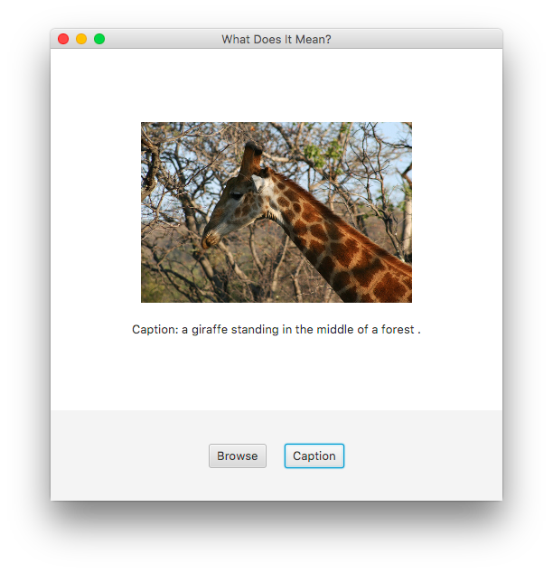

# What Does It Mean?

A native caption generation application using the Show and Tell model.



## Quick Start

[](https://www.youtube.com/watch?v=tB1WtMTo-Yo)

This application works best on OS X, but it is compatible with multiple
platforms. In order to run the installation scripts on any system, several
dependencies are required:

**Required Dependencies (all systems):**

* [JDK 8](https://www.oracle.com/technetwork/java/javase/downloads/jdk8-downloads-2133151.html)
* [Maven](https://maven.apache.org/)
* [Tensorflow-compatible Python](https://www.python.org/) (we recommend 3.6 or 2.7)
* [Bazel](https://bazel.build/)

### OS X (Recommended)

**Required OS X Dependencies:**

* [Homebrew package manager](https://brew.sh/)

This application was built and tested primarily on OS X machines, so we
recommend OS X for the smoothest build/run process.

To install and build the application, run:

```bash
bin/install.osx.sh && bin/build.sh
```

To start the application, run:

```bash
bin/run.sh
```

### Ubuntu

**Required Ubuntu Dependencies:**

* `apt` package manager
* sudo access (for dependency installation)

The installation process for Ubuntu is similar for OS X.

To install and build the application, run:

```bash
bin/install.ubuntu.sh && bin/build.sh
```

To start the application, run:

```bash
bin/run.sh
```

### Other Operating System (e.g. Windows, Mint, Debian, etc.)

We don't provide built-in support for other operating systems, but that doesn't
mean that the application won't work! Using `bin/install.osx.sh` and
`bin/build.sh` as a guide, install the dependencies and build the project
manually.

After that, you can start the application with:

```bash
bin/run.sh
```

## Validation and Testing

Validation and tests are part of the build process, but you can also run
them independently with the following commands:

```bash
mvn validate  # runs style check
mvn test      # runs automated tests
```

Make sure the tests pass before pushing code to GitHub!
