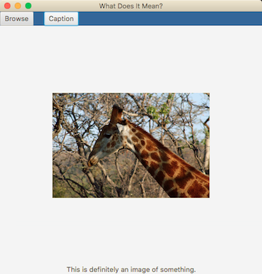

# What Does It Mean?

A native caption generation application using the Show and Tell model.



## Quick Start

This app requires [Maven](https://maven.apache.org/install.html) for setup.

First, build the app:

```bash
mvn package
```

Next, launch the app with Maven:

```bash
mvn exec:java
```

Voilà, the app is running!

## Validation and Testing

Validation and tests are part of the build process, but you can also run
them independently with the following commands:

```bash
mvn validate  # runs style check
mvn test      # runs automated tests
```

Make sure the tests pass before pushing code to GitHub!
